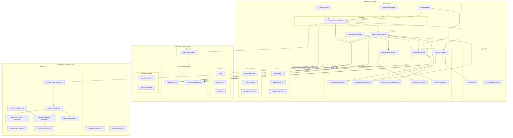

```mermaid
flowchart TD
    subgraph AuthPkg["auth 패키지 (인증·세션)"]
        subgraph AuthPresentation["Presentation"]
            AuthController
            VerificationController
            OAuthController
        end

        subgraph AuthCommand["Command"]
            AccountCommandHandler
        end

        subgraph AuthStrategy["Strategy"]
            EmailAccountStrategy
            SocialAccountStrategy
        end

        subgraph AuthApplication["Application"]
            AuthSessionService
            VerificationService
            MailService
            AccountLinkingService
        end

        subgraph AuthOAuth["OAuth2 Clients"]
            OAuthClient["OAuthClient (interface)"]
            GoogleOAuthClient
            KakaoOAuthClient
        end

        subgraph AuthInfra["Infrastructure (Redis)"]
            AuthSessionRepository
            PendingSignupRepository
            VerificationSessionRepository
        end

        subgraph AuthDomain["Domain"]
            AuthSession
            PendingSignup
            VerificationSession
        end

        subgraph AuthEvent["Events / Listener"]
            LoginFailedEvent
            LinkFactorEvent
            AuthEventListener
        end
    end

    subgraph UserPkg["user 패키지 (신원 도메인)"]
        subgraph UserApplication["Application"]
            UserCreationService
        end

        subgraph UserDomain["Domain"]
            User
            UserAccount
            Provider
        end

        subgraph UserInfra["Infrastructure (JPA)"]
            UserRepository
            UserAccountRepository
        end

        subgraph UserEvent["Events / Listener"]
            UserRegisterEvent
            UserEventHandler
        end
    end

    subgraph GlobalPkg["global 패키지 (공통 인프라)"]
        subgraph Security["Security"]
            SecurityFacade["SecurityFacade (interface)"]
            SecurityFacadeImpl
            JwtTokenProvider["JwtTokenProvider (interface)"]
            JwtTokenProviderImpl
            JwtTokenValidator["JwtTokenValidator (interface)"]
            JwtTokenValidatorImpl
            TokenCookieFactory
            JwtAuthenticationFilter
        end
        GlobalExceptionAdvice
        CommonResponse
    end

    %% ── Presentation → Command ──────────────────────────────
    AuthController --> AccountCommandHandler
    AuthController --> AuthSessionService
    VerificationController --> AccountCommandHandler
    OAuthController --> AccountCommandHandler

    %% ── Command → Strategy / Application ───────────────────
    AccountCommandHandler --> EmailAccountStrategy
    AccountCommandHandler --> SocialAccountStrategy
    AccountCommandHandler --> VerificationService
    AccountCommandHandler --> UserCreationService
    AccountCommandHandler --> UserRepository

    %% ── Strategy → Application / Infrastructure ─────────────
    EmailAccountStrategy --> AuthSessionService
    EmailAccountStrategy --> VerificationService
    EmailAccountStrategy --> UserRepository
    EmailAccountStrategy --> UserAccountRepository
    EmailAccountStrategy --> PendingSignupRepository

    SocialAccountStrategy --> AuthSessionService
    SocialAccountStrategy --> OAuthClient
    SocialAccountStrategy --> UserRepository
    SocialAccountStrategy --> UserAccountRepository

    %% ── OAuth2 ──────────────────────────────────────────────
    OAuthClient --> GoogleOAuthClient
    OAuthClient --> KakaoOAuthClient

    %% ── Application → Infrastructure / Security ─────────────
    AuthSessionService --> AuthSessionRepository
    AuthSessionService --> UserRepository
    AuthSessionService --> SecurityFacade

    VerificationService --> VerificationSessionRepository
    VerificationService --> PendingSignupRepository
    VerificationService --> UserRepository
    VerificationService --> MailService

    UserCreationService --> UserRepository

    %% ── Security implementations ────────────────────────────
    SecurityFacade --> SecurityFacadeImpl
    SecurityFacadeImpl --> JwtTokenProvider
    SecurityFacadeImpl --> JwtTokenValidator
    SecurityFacadeImpl --> TokenCookieFactory

    JwtTokenProvider --> JwtTokenProviderImpl
    JwtTokenValidator --> JwtTokenValidatorImpl

    JwtAuthenticationFilter --> JwtTokenValidator

    %% ── auth → user 단방향 의존 ──────────────────────────────
    EmailAccountStrategy -. "User 엔티티 참조" .-> UserPkg
    SocialAccountStrategy -. "User 엔티티 참조" .-> UserPkg
    AuthSessionService -. "User 엔티티 참조" .-> UserPkg
    AccountCommandHandler -. "UserCreationService 위임" .-> UserPkg
```