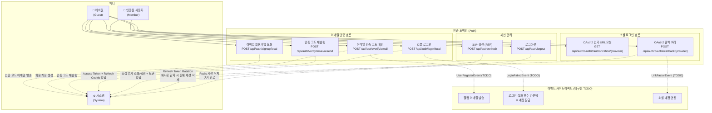

```mermaid
%%{init: {'theme': 'default'}}%%
graph TB
    subgraph Actors["액터"]
        Guest["👤 비회원\n(Guest)"]
        Member["👤 인증된 사용자\n(Member)"]
        System["⚙️ 시스템\n(System)"]
    end

    subgraph Auth["인증 도메인 (Auth)"]
        subgraph Local["이메일 인증 흐름"]
            UC1["이메일 회원가입 요청\nPOST /api/auth/signup/local"]
            UC2["이메일 인증 코드 확인\nPOST /api/auth/verify/email"]
            UC3["인증 코드 재발송\nPOST /api/auth/verify/email/resend"]
            UC4["로컬 로그인\nPOST /api/auth/login/local"]
        end

        subgraph OAuth["소셜 로그인 흐름"]
            UC5["OAuth2 인가 URL 요청\nGET /api/auth/oauth2/authorization/{provider}"]
            UC6["OAuth2 콜백 처리\nPOST /api/auth/oauth2/callback/{provider}"]
        end

        subgraph Session["세션 관리"]
            UC7["토큰 갱신 (RTR)\nPOST /api/auth/refresh"]
            UC8["로그아웃\nPOST /api/auth/logout"]
        end
    end

    subgraph SideEffects["이벤트 사이드이펙트 (미구현 TODO)"]
        UC9["웰컴 이메일 발송"]
        UC10["로그인 실패 횟수 카운팅\n& 계정 잠금"]
        UC11["소셜 계정 연동"]
    end

    %% 비회원 유즈케이스
    Guest --> UC1
    Guest --> UC2
    Guest --> UC3
    Guest --> UC4
    Guest --> UC5
    Guest --> UC6

    %% 인증된 사용자 유즈케이스
    Member --> UC7
    Member --> UC8

    %% 시스템 내부 흐름
    UC1 -. "인증 코드 이메일 발송" .-> System
    UC2 -. "회원 계정 생성" .-> System
    UC3 -. "인증 코드 재발송" .-> System
    UC4 -. "Access Token + Refresh Cookie 발급" .-> System
    UC6 -. "소셜 유저 조회/생성 + 토큰 발급" .-> System
    UC7 -. "Refresh Token Rotation\n재사용 감지 시 전체 세션 삭제" .-> System
    UC8 -. "Redis 세션 삭제\n쿠키 만료" .-> System

    %% 미구현 이벤트
    UC2 -.->|"UserRegisterEvent (TODO)"| UC9
    UC4 -.->|"LoginFailedEvent (TODO)"| UC10
    UC6 -.->|"LinkFactorEvent (TODO)"| UC11
```